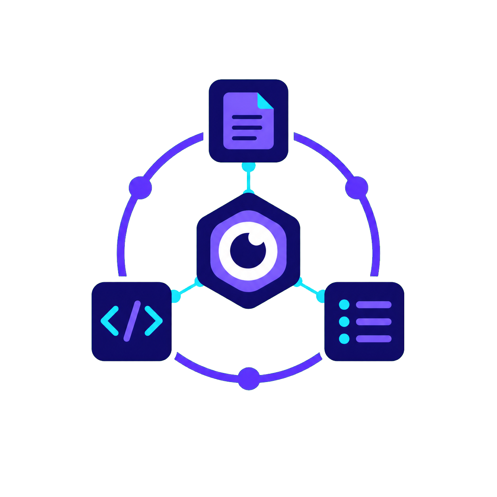

<p align="center">
  <a href="https://github.com/MeryllEssig/senpai">
    
  </a>
</p>

<h2 align="center"><a href="https://github.com/MeryllEssig/senpai">Senpai</a></h2>

<p align="center">
  Declarative, project-scoped context for AI coding agents.
</p>

Senpai gives an AI agent the context it needs to work in a project without
requiring that context to be repeated each session. A commented
`.senpai.jsonc` manifest describes the project's trackers, code-hosting
instances, repositories, environments, documentation, workflows, and safe
bounded operations. The `senpai` CLI then returns only the relevant slice.

It is designed for Codex, Claude Code, Gemini CLI, OpenCode, and other agents
that can run commands and follow Markdown instructions.

> [!IMPORTANT]
> Never put secrets in `.senpai.jsonc` or `.senpai.local.jsonc`. Private
> capsule values belong in the gitignored `.senpai/capsules.local.json` file,
> where Senpai resolves and scrubs them during execution.

## Why Senpai?

Project knowledge is often scattered between people, scripts, ticket trackers,
code-hosting platforms, and environment-specific runbooks. Senpai keeps a
small, reviewable declaration beside the project so an agent can reliably:

- route ticket and code-hosting tasks by declared role;
- understand multi-repository projects and their dependencies;
- find environments, documentation, rules, and relevant workflows;
- run declared tests, diagnostics, exports, or database queries as bounded
  capsules; and
- keep machine-local preferences and private values out of the shared manifest.

The result is portable context rather than a central registry or an
agent-specific configuration format.

## Quick start

Build the CLI, then add a manifest at your project root (or in a parent
directory when the repository must remain untouched):

```sh
cargo build --release
```

```jsonc
// .senpai.jsonc
{
  "version": 1,
  "project": {
    "name": "my-service",
    "label": "My Service",
    "context": "API used by the customer portal.",
    "stack": ["Rust", "PostgreSQL"]
  },
  "repos": {
    "app": { "path": "." }
  },
  "environments": {
    "local": { "label": "Local development", "repo": "app" }
  },
  "capsules": {
    "test": {
      "label": "Run the test suite",
      "type": "test",
      "repo": "app",
      "environment": "local",
      "command": "cargo test"
    }
  }
}
```

From any directory inside that project, Senpai discovers the manifest by
walking upward, like Git:

```sh
./target/release/senpai validate manifest --json
./target/release/senpai summary --json
./target/release/senpai list capsules --json
./target/release/senpai run test --json
```

Start from the fully annotated [reference manifest](doc/reference-manifest.jsonc)
for every supported declaration and field shape.

## How it works

```text
.senpai.jsonc ──► senpai CLI ──► focused context for the agent
       │                │
       │                └──► declared capsules only (no shell, bounded output)
       └──► optional .senpai.local.jsonc overlay
```

The committed manifest is JSONC, so it can explain the project's ecosystem in
place. A personal `.senpai.local.jsonc` overlay is deep-merged locally for
paths, preferences, or authentication configuration. Capsule values are kept
separately because they may contain secrets.

Senpai is deliberately not an orchestration engine: manifest queries never
contact external services. The only execution surface is `senpai run`, which
runs a declared capsule.

## Capsules: bounded operations without secret leakage

A capsule is a deterministic, non-interactive argv command. It is suitable for
finite operations such as tests, builds, bounded log reads, exports, or a
single database query.

```jsonc
"db-preprod": {
  "label": "Run one read-only query",
  "type": "database-query",
  "environment": "preprod",
  "access": "read-only",
  "command": "mysql --password={password} app --execute {query}",
  "supplied": ["query"],
  "timeout_seconds": 30,
  "max_output_bytes": 1048576
}
```

`{query}` is supplied by the agent at invocation time. `{password}` is resolved
inside Senpai from `.senpai/capsules.local.json` and is never printed in the
resolved command or process output.

```sh
senpai init
senpai validate local --json
senpai run db-preprod --query "SELECT id FROM orders LIMIT 5" --json
```

> [!NOTE]
> Capsules receive no shell, stdin, or TTY. Shell operators, foreground
> servers, interactive shells, and follow-mode logs are intentionally outside
> the model.

## Scoped CLI queries

Use `resolve` once at the start of an agent session, then retain the returned
absolute manifest path for subsequent scoped queries.

```sh
senpai resolve --json
senpai summary --manifest /absolute/path/.senpai.jsonc --json

senpai get repo --current --with-dependencies --json
senpai get tracker --role ticket_details --json
senpai get hosting --role merge_requests --repo app --json
senpai get workflow --domain code_changes --json
senpai list capsules --repo app --env preprod --json
```

Commands produce compact Markdown by default or a stable JSON envelope with
`--json`. See the complete [CLI contract](doc/cli-contract.md) for commands,
exit codes, filtering, and output guarantees.

## Agent skills

Senpai ships Markdown skills for agent ecosystems that support them:

- `senpai-use-project-context` — resolve a manifest and retrieve only the
  needed context.
- `senpai-setup-project-context` — interview, create, and validate a new
  manifest.
- `senpai-manage-project-context` — safely evolve an existing manifest.
- `senpai-discover-project-automation` — propose safe automation
  opportunities without applying them.
- `senpai-project-management` and `senpai-code-hosting` — common interfaces
  with platform-specific guidance, including a standard-library Redmine
  adapter.

Ticket and code-change workflows combine explicit `allow`, `confirm`, and
`deny` policies with project-specific instructions. When no workflow is
declared, reads are allowed and writes are denied.

## Install locally

Release downloads are not available yet. Build a release binary and install it
with the shipped skills for the agent ecosystems you use:

```sh
cargo build --release
./installer.sh \
  --binary ./target/release/senpai \
  --skills-dir ./skills \
  --agents codex,claude
```

The installer supports `codex`, `claude`, `gemini`, `opencode`, `all`, and
`none`; use `--yes` for non-interactive automation. It records exactly the
binary and `senpai-*` skill directories it owns, allowing a safe removal:

```sh
./installer.sh --uninstall
```

Read [local installation](doc/installation.md) for destination paths, custom
prefixes, ownership tracking, and uninstall behavior.

## Development

Prerequisites: stable Rust, Bun, and Bash. Python 3 is required only for the
Redmine adapter and its tests.

```sh
bun install
bun run verify
```

`bun run verify` validates the reference JSONC files, runs installer and CLI
contract tests, checks Rust formatting, runs Clippy with warnings denied, and
runs the Rust test suite.

Useful focused checks:

```sh
bun run test:installer
bun run test:cli
cargo test
```

## Documentation

- [Goals and non-goals](doc/goal.md)
- [Technical considerations](doc/technical-considerations.md)
- [CLI contract](doc/cli-contract.md)
- [Manifest JSON Schema](schema/senpai.schema.json)
- [Reference manifest](doc/reference-manifest.jsonc)
- [Reference local capsule values](doc/reference-capsule.jsonc)
- [User stories](doc/user-stories.md)

## Repository layout

| Path | Purpose |
|---|---|
| `src/` | Standalone Rust CLI |
| `schema/` | Versioned manifest JSON Schema |
| `skills/` | Skills installed for supported agent ecosystems |
| `maintainer/` | Maintainer-only quality-assurance skill |
| `doc/` | Product design, contract, rationale, and examples |
| `tests/` | Hermetic CLI and installer tests |
